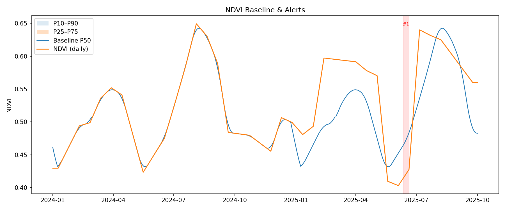

# NDVI 异常简报 · 2025

- 事件数：**2**；累计天数：**21**

## 重点事件（Top 5）

| type   | start_date   | end_date   |   duration_days |    min | deficit   | dry_days_share   | high_cloud_share   | precip7_mean   |
|:-------|:-------------|:-----------|----------------:|-------:|:----------|:-----------------|:-------------------|:---------------|
| season | 2025-06-11   | 2025-06-20 |              10 | -0.056 | 0.524     | 0.6              | 0.0                | 7.78           |
| slope  | 2025-05-11   | 2025-05-21 |              11 | -0.1   |           |                  |                    |                |

## 可视图

