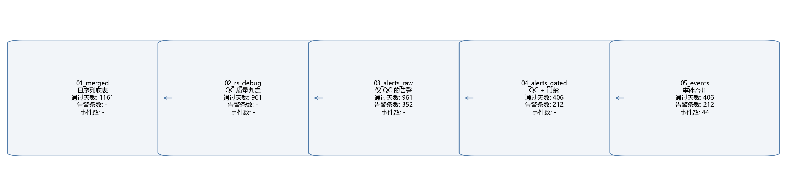
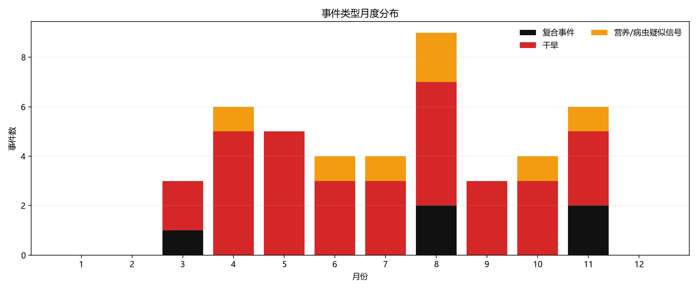
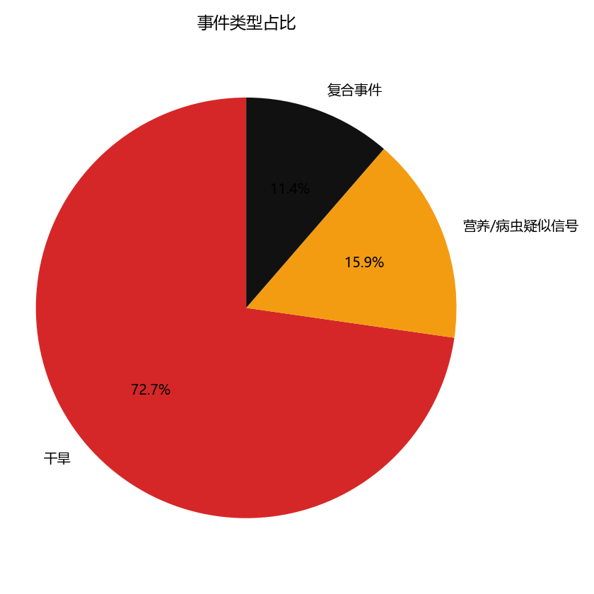

# 复合告警筛选链条简报

## 筛选层级解释表

|Stage|文件名|粒度|这一步做什么|通过条件 (中文)|输出给下一步什么|
|---|---|---|---|---|---|
|01|01_merged.csv|日|日序列底表 (气象+遥感+滚动统计)|对齐日期, 无筛选|完整日序列给 QC|
|02|02_rs_debug.csv|日|QC (质量控制) 判定表|真实观测/窗口可用/气象完整/指标有限|产出 qc_ok / allow_alert 给告警|
|03|03_alerts_raw.csv|告警|raw (只看 QC) 触发告警|qc_ok & 告警规则触发|提供 raw 告警条数|
|04|04_alerts_gated.csv|告警|gated (门禁/gating) 后保留告警|allow_alert & 告警规则触发|作为主输出告警清单|
|05|05_events.csv|事件|event merge (事件合并)|同类告警 gap<=X 天合并|起止/峰值/摘要 事件清单|

## 筛选漏斗 (日数 + 告警条数 + 事件数)

一句话回答 “筛了几次”:
QC (质量控制) 筛日子 1161 -> 961,
gating (门禁) 筛日子 961 -> 406,
事件合并把告警 212 条压成 44 件.

提示: QC 会区分 真实观测日 与 window (窗口) 支撑日.

逻辑清楚一句话:
告警产生条件是 QC通过 (数据可用) -> gating通过 (允许告警) -> 规则触发.

## 最终输出概览

- 统计范围: 2023-01-01 至 2025-10-01
- 筛完剩余天数: 406
- raw 告警 (QC后) : 352 条
- gated 告警 (门禁后) : 212 条
- 合并事件: 44 件

## 告警类型数量 (gated)

|告警类型|数量|
|---|---|
|干旱|179|
|营养/病虫疑似信号|21|
|复合事件|12|

## 事件类型数量 (merged)

|事件类型|数量|
|---|---|
|干旱|32|
|营养/病虫疑似信号|7|
|复合事件|5|

## 事件类型月度分布

## 事件类型占比

## 术语表 (简短定义)

- QC (质量控制): 判断某天遥感指数是否可用
- window (窗口): 前后两天含当天的支撑窗口 (±2)
- 真实观测日: 当天存在遥感原始观测值 (*_obs 非空)
- rs_age: 当天距离最近遥感观测日的天数
- gating (门禁): 生长季/冠层条件过滤, 仅决定日期资格
- allow_alert (允许告警): QC + gating 合格的日子
- raw vs gated: raw=只看 QC, gated=再加 gating
- event merge (事件合并): 连续告警天合并为事件
