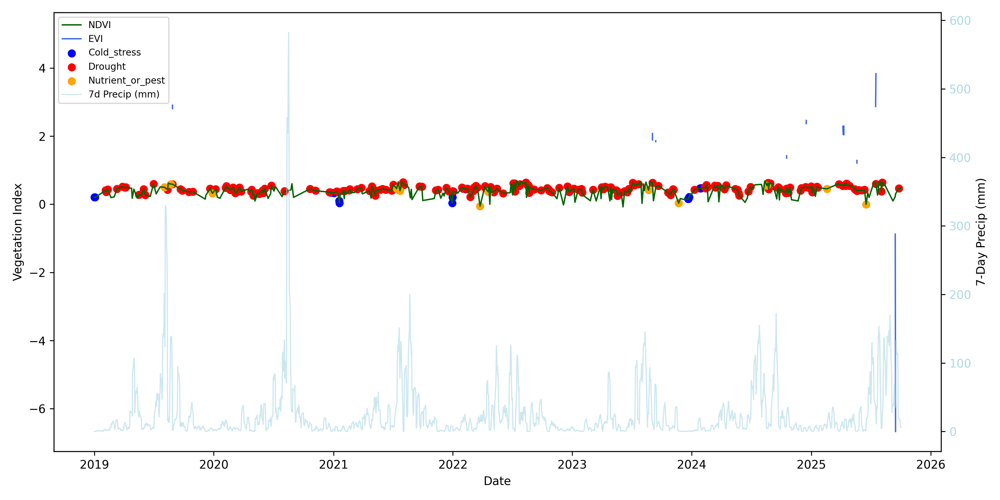
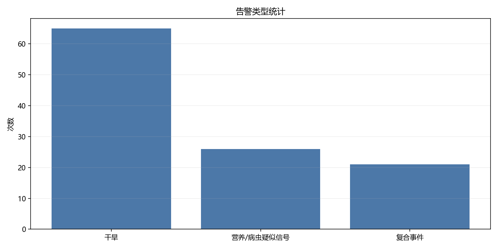
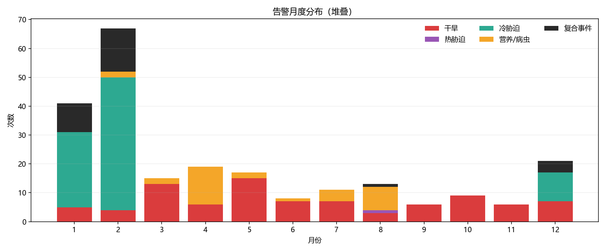
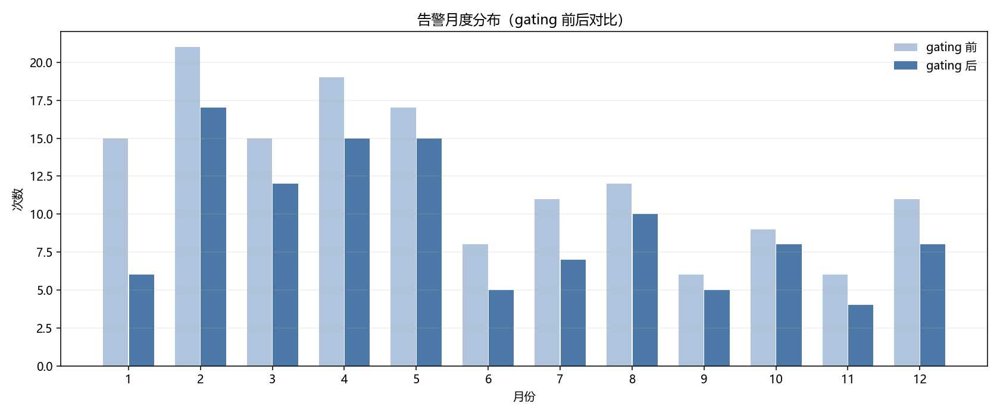

# 复合告警业务简报

## 业务要点

- 数据范围：2019-01-01 ~ 2025-10-01，共 2473 天
- 逐日触发 112 次，其中复合事件 21 次；合并后事件 97 次；最频繁类型为 干旱（65 次）。

## 遥感质量与覆盖

- 数据范围：2019-01-01 ~ 2025-10-01，共 2473 天
- 序列完整率：100.0%（基于 ndvi_mean_daily）
- 真实观测有效率：13.8%（基于真实遥感观测日）
- 真实观测最大间隔：50 天

### 真实遥感观测次数（按月）

|   月份 |   真实观测次数 |
|-----:|---------:|
|    1 |       25 |
|    2 |       28 |
|    3 |       29 |
|    4 |       38 |
|    5 |       34 |
|    6 |       26 |
|    7 |       38 |
|    8 |       46 |
|    9 |       26 |
|   10 |       15 |
|   11 |       14 |
|   12 |       23 |

### 真实遥感观测次数（按季）

|   季度 |   真实观测次数 |
|-----:|---------:|
|    1 |       82 |
|    2 |       98 |
|    3 |      110 |
|    4 |       52 |

### 被跳过的天数及原因

| 原因           |   天数 |
|:-------------|-----:|
| 缺遥感          | 1132 |
| 缺气象          |    0 |
| 超 rs_max_age |  999 |

## 行动建议

- 干旱事件：关注灌溉与土壤墒情，必要时安排补水。
- 营养/病虫疑似信号：结合田间巡查，评估追肥或病虫防治。
- 复合事件：优先现场核查，多因素协同处置。

## 假阳性控制（本期生效）

- 生长季 gating + 缺测拦截 + 事件合并后，告警数量显著收敛。
- gating 前后月度分布对比见下图。
- gating 模式：canopy_obs，canopy_obs_min=2，gating_months=[4, 5, 6, 7, 8, 9, 10]

## 可视化

- 注：事件标记点位置使用对应日期的 NDVI/EVI 值，仅用于表达事件发生日期。

## 告警概览（逐日）

| 事件类型      |   次数 |
|:----------|-----:|
| 干旱        |   65 |
| 营养/病虫疑似信号 |   26 |
| 复合事件      |   21 |

## 月度分布（逐日）

|   月份 |   事件数 |
|-----:|------:|
|    1 |     6 |
|    2 |    17 |
|    3 |    12 |
|    4 |    15 |
|    5 |    15 |
|    6 |     5 |
|    7 |     7 |
|    8 |    10 |
|    9 |     5 |
|   10 |     8 |
|   11 |     4 |
|   12 |     8 |

## 月度分布对比（gating 前后）

|   月份 |   gating前 |   gating后 |
|-----:|----------:|----------:|
|    1 |        15 |         6 |
|    2 |        21 |        17 |
|    3 |        15 |        12 |
|    4 |        19 |        15 |
|    5 |        17 |        15 |
|    6 |         8 |         5 |
|    7 |        11 |         7 |
|    8 |        12 |        10 |
|    9 |         6 |         5 |
|   10 |         9 |         8 |
|   11 |         6 |         4 |
|   12 |        11 |         8 |

## 事件明细（最新20条）

| 日期         | 事件类型      | 触发原因                                 |
|:-----------|:----------|:-------------------------------------|
| 2019-02-06 | 复合事件      | drought + cold_stress                |
| 2019-02-11 | 复合事件      | drought + cold_stress                |
| 2019-03-28 | 干旱        | NDMI=0.175/MSI=0.750; precip_7d=1.8  |
| 2019-04-05 | 营养/病虫疑似信号 | NDRE=0.337, GNDVI=0.430, NDMI=0.229  |
| 2019-04-07 | 干旱        | NDMI=0.175/MSI=0.748; precip_7d=11.8 |
| 2019-08-03 | 营养/病虫疑似信号 | NDRE=0.370, GNDVI=0.410, NDMI=0.272  |
| 2019-08-23 | 营养/病虫疑似信号 | NDRE=0.406, GNDVI=0.494, NDMI=0.256  |
| 2019-09-22 | 干旱        | NDMI=0.123/MSI=0.809; precip_7d=7.0  |
| 2019-09-27 | 干旱        | NDMI=0.091/MSI=0.859; precip_7d=8.4  |
| 2020-02-09 | 营养/病虫疑似信号 | NDRE=0.360, GNDVI=0.465, NDMI=0.203  |
| 2020-02-11 | 干旱        | NDMI=0.180/MSI=0.731; precip_7d=11.7 |
| 2020-02-16 | 复合事件      | drought + cold_stress                |
| 2020-02-19 | 复合事件      | cold_stress + nutrient_or_pest       |
| 2020-02-21 | 复合事件      | drought + cold_stress                |
| 2020-02-29 | 干旱        | NDMI=0.166/MSI=0.764; precip_7d=3.7  |
| 2020-03-20 | 干旱        | NDMI=0.178/MSI=0.747; precip_7d=1.4  |
| 2020-03-25 | 干旱        | NDMI=0.192/MSI=0.704; precip_7d=2.6  |
| 2020-04-24 | 营养/病虫疑似信号 | NDRE=0.228, GNDVI=0.320, NDMI=0.202  |
| 2020-04-26 | 干旱        | NDMI=0.130/MSI=0.791; precip_7d=0.9  |
| 2020-05-01 | 干旱        | NDMI=0.088/MSI=0.841; precip_7d=0.0  |

## 合并后事件统计

| 事件类型      | 起始日期       | 结束日期       |   持续天数 | 峰值日期       |    峰值强度 | 原因摘要                                                                       |
|:----------|:-----------|:-----------|-------:|:-----------|--------:|:---------------------------------------------------------------------------|
| 复合事件      | 2019-02-06 | 2019-02-06 |      1 | 2019-02-06 | nan     | drought + cold_stress                                                      |
| 复合事件      | 2019-02-11 | 2019-02-11 |      1 | 2019-02-11 | nan     | drought + cold_stress                                                      |
| 干旱        | 2019-03-28 | 2019-03-28 |      1 | 2019-03-28 |   0.024 | NDMI=0.175/MSI=0.750; precip_7d=1.8                                        |
| 营养/病虫疑似信号 | 2019-04-05 | 2019-04-05 |      1 | 2019-04-05 |  -0.037 | NDRE=0.337, GNDVI=0.430, NDMI=0.229                                        |
| 干旱        | 2019-04-07 | 2019-04-07 |      1 | 2019-04-07 |   0.025 | NDMI=0.175/MSI=0.748; precip_7d=11.8                                       |
| 营养/病虫疑似信号 | 2019-08-03 | 2019-08-03 |      1 | 2019-08-03 |  -0.07  | NDRE=0.370, GNDVI=0.410, NDMI=0.272                                        |
| 营养/病虫疑似信号 | 2019-08-23 | 2019-08-23 |      1 | 2019-08-23 |  -0.106 | NDRE=0.406, GNDVI=0.494, NDMI=0.256                                        |
| 干旱        | 2019-09-22 | 2019-09-22 |      1 | 2019-09-22 |   0.077 | NDMI=0.123/MSI=0.809; precip_7d=7.0                                        |
| 干旱        | 2019-09-27 | 2019-09-27 |      1 | 2019-09-27 |   0.109 | NDMI=0.091/MSI=0.859; precip_7d=8.4                                        |
| 营养/病虫疑似信号 | 2020-02-09 | 2020-02-09 |      1 | 2020-02-09 |  -0.06  | NDRE=0.360, GNDVI=0.465, NDMI=0.203                                        |
| 干旱        | 2020-02-11 | 2020-02-11 |      1 | 2020-02-11 |   0.02  | NDMI=0.180/MSI=0.731; precip_7d=11.7                                       |
| 复合事件      | 2020-02-16 | 2020-02-16 |      1 | 2020-02-16 | nan     | drought + cold_stress                                                      |
| 复合事件      | 2020-02-19 | 2020-02-21 |      3 | 2020-02-19 | nan     | cold_stress + nutrient_or_pest | drought + cold_stress                     |
| 干旱        | 2020-02-29 | 2020-02-29 |      1 | 2020-02-29 |   0.034 | NDMI=0.166/MSI=0.764; precip_7d=3.7                                        |
| 干旱        | 2020-03-20 | 2020-03-20 |      1 | 2020-03-20 |   0.022 | NDMI=0.178/MSI=0.747; precip_7d=1.4                                        |
| 干旱        | 2020-03-25 | 2020-03-25 |      1 | 2020-03-25 |   0.008 | NDMI=0.192/MSI=0.704; precip_7d=2.6                                        |
| 营养/病虫疑似信号 | 2020-04-24 | 2020-04-24 |      1 | 2020-04-24 |   0.072 | NDRE=0.228, GNDVI=0.320, NDMI=0.202                                        |
| 干旱        | 2020-04-26 | 2020-04-26 |      1 | 2020-04-26 |   0.07  | NDMI=0.130/MSI=0.791; precip_7d=0.9                                        |
| 干旱        | 2020-05-01 | 2020-05-01 |      1 | 2020-05-01 |   0.112 | NDMI=0.088/MSI=0.841; precip_7d=0.0                                        |
| 干旱        | 2020-05-04 | 2020-05-04 |      1 | 2020-05-04 |   0.166 | NDMI=0.034/MSI=0.957; precip_7d=0.1                                        |
| 干旱        | 2020-05-19 | 2020-05-19 |      1 | 2020-05-19 |   0.132 | NDMI=0.069/MSI=0.893; precip_7d=10.3                                       |
| 干旱        | 2020-05-31 | 2020-05-31 |      1 | 2020-05-31 |   0.101 | NDMI=0.099/MSI=0.842; precip_7d=10.5                                       |
| 营养/病虫疑似信号 | 2020-07-08 | 2020-07-08 |      1 | 2020-07-08 |  -0.082 | NDRE=0.383, GNDVI=0.421, NDMI=0.219                                        |
| 干旱        | 2020-11-07 | 2020-11-07 |      1 | 2020-11-07 |   0.174 | NDMI=0.026/MSI=0.990; precip_7d=3.0                                        |
| 复合事件      | 2020-12-20 | 2020-12-20 |      1 | 2020-12-20 | nan     | drought + cold_stress                                                      |
| 复合事件      | 2021-01-14 | 2021-01-14 |      1 | 2021-01-14 | nan     | drought + cold_stress                                                      |
| 干旱        | 2021-02-20 | 2021-02-20 |      1 | 2021-02-20 |   0.054 | NDMI=0.145/MSI=0.787; precip_7d=7.4                                        |
| 干旱        | 2021-03-27 | 2021-03-27 |      1 | 2021-03-27 |   0.017 | NDMI=0.183/MSI=0.722; precip_7d=4.2                                        |
| 干旱        | 2021-05-31 | 2021-05-31 |      1 | 2021-05-31 |   0.092 | NDMI=0.108/MSI=0.835; precip_7d=5.9                                        |
| 干旱        | 2021-06-10 | 2021-06-10 |      1 | 2021-06-10 |   0.053 | NDMI=0.147/MSI=0.758; precip_7d=11.6                                       |
| 营养/病虫疑似信号 | 2021-07-13 | 2021-07-13 |      1 | 2021-07-13 |  -0.062 | NDRE=0.362, GNDVI=0.348, NDMI=0.284                                        |
| 营养/病虫疑似信号 | 2021-07-23 | 2021-07-23 |      1 | 2021-07-23 |   0.018 | NDRE=0.282, GNDVI=0.306, NDMI=0.253                                        |
| 干旱        | 2021-08-04 | 2021-08-04 |      1 | 2021-08-04 |   0.026 | NDMI=0.174/MSI=0.740; precip_7d=0.2                                        |
| 干旱        | 2021-11-17 | 2021-11-17 |      1 | 2021-11-17 |   0.11  | NDMI=0.090/MSI=0.861; precip_7d=0.0                                        |
| 复合事件      | 2022-01-31 | 2022-01-31 |      1 | 2022-01-31 | nan     | drought + cold_stress                                                      |
| 复合事件      | 2022-02-13 | 2022-02-15 |      3 | 2022-02-13 | nan     | drought + cold_stress                                                      |
| 复合事件      | 2022-02-23 | 2022-02-23 |      1 | 2022-02-23 | nan     | cold_stress + nutrient_or_pest                                             |
| 干旱        | 2022-03-05 | 2022-03-07 |      3 | 2022-03-07 |   0.031 | NDMI=0.180/MSI=0.719; precip_7d=0.9 | NDMI=0.169/MSI=0.750; precip_7d=4.4  |
| 干旱        | 2022-03-10 | 2022-03-12 |      3 | 2022-03-12 |   0.069 | NDMI=0.176/MSI=0.734; precip_7d=4.3 | NDMI=0.131/MSI=0.822; precip_7d=4.4  |
| 干旱        | 2022-03-15 | 2022-03-17 |      3 | 2022-03-17 |   0.016 | NDMI=0.187/MSI=0.718; precip_7d=6.0 | NDMI=0.184/MSI=0.724; precip_7d=11.9 |
| 营养/病虫疑似信号 | 2022-04-19 | 2022-04-19 |      1 | 2022-04-19 |   0.057 | NDRE=0.242, GNDVI=0.300, NDMI=0.278                                        |
| 营养/病虫疑似信号 | 2022-05-09 | 2022-05-09 |      1 | 2022-05-09 |   0.055 | NDRE=0.245, GNDVI=0.370, NDMI=0.210                                        |
| 干旱        | 2022-07-10 | 2022-07-10 |      1 | 2022-07-10 |   0.027 | NDMI=0.173/MSI=0.718; precip_7d=0.8                                        |
| 营养/病虫疑似信号 | 2022-07-23 | 2022-07-23 |      1 | 2022-07-23 |  -0.094 | NDRE=0.394, GNDVI=0.471, NDMI=0.238                                        |
| 干旱        | 2022-08-22 | 2022-08-22 |      1 | 2022-08-22 |   0.044 | NDMI=0.155/MSI=0.743; precip_7d=0.0                                        |
| 复合事件      | 2022-08-24 | 2022-08-24 |      1 | 2022-08-24 | nan     | drought + heat_stress                                                      |
| 干旱        | 2022-09-06 | 2022-09-06 |      1 | 2022-09-06 |   0.018 | NDMI=0.182/MSI=0.702; precip_7d=9.5                                        |
| 干旱        | 2022-10-16 | 2022-10-16 |      1 | 2022-10-16 |   0.13  | NDMI=0.070/MSI=0.906; precip_7d=1.7                                        |
| 干旱        | 2022-10-21 | 2022-10-23 |      3 | 2022-10-21 |   0.156 | NDMI=0.043/MSI=0.958; precip_7d=0.0 | NDMI=0.048/MSI=0.942; precip_7d=0.0  |
| 干旱        | 2022-10-31 | 2022-10-31 |      1 | 2022-10-31 |   0.131 | NDMI=0.069/MSI=0.892; precip_7d=12.1                                       |
| 复合事件      | 2022-12-22 | 2022-12-22 |      1 | 2022-12-22 | nan     | drought + cold_stress                                                      |
| 干旱        | 2023-01-06 | 2023-01-06 |      1 | 2023-01-06 |   0.066 | NDMI=0.135/MSI=0.790; precip_7d=2.7                                        |
| 复合事件      | 2023-01-29 | 2023-01-31 |      3 | 2023-01-29 | nan     | drought + cold_stress                                                      |
| 营养/病虫疑似信号 | 2023-04-04 | 2023-04-06 |      3 | 2023-04-06 |  -0     | NDRE=0.340, GNDVI=0.431, NDMI=0.205 | NDRE=0.300, GNDVI=0.413, NDMI=0.209  |
| 营养/病虫疑似信号 | 2023-04-09 | 2023-04-09 |      1 | 2023-04-09 |  -0.031 | NDRE=0.331, GNDVI=0.450, NDMI=0.204                                        |
| 干旱        | 2023-04-11 | 2023-04-11 |      1 | 2023-04-11 |   0.014 | NDMI=0.186/MSI=0.718; precip_7d=13.7                                       |
| 干旱        | 2023-05-16 | 2023-05-16 |      1 | 2023-05-16 |   0.124 | NDMI=0.076/MSI=0.906; precip_7d=2.7                                        |
| 干旱        | 2023-06-18 | 2023-06-18 |      1 | 2023-06-18 |   0.057 | NDMI=0.143/MSI=0.767; precip_7d=5.7                                        |
| 干旱        | 2023-06-23 | 2023-06-23 |      1 | 2023-06-23 |   0.025 | NDMI=0.175/MSI=0.724; precip_7d=6.6                                        |
| 干旱        | 2023-07-08 | 2023-07-10 |      3 | 2023-07-10 |   0.017 | NDMI=0.195/MSI=0.701; precip_7d=10.1 | NDMI=0.183/MSI=0.716; precip_7d=2.6 |
| 营养/病虫疑似信号 | 2023-08-22 | 2023-08-22 |      1 | 2023-08-22 |   0.006 | NDRE=0.294, GNDVI=0.331, NDMI=0.262                                        |
| 干旱        | 2023-09-21 | 2023-09-21 |      1 | 2023-09-21 |   0.091 | NDMI=0.109/MSI=0.848; precip_7d=12.3                                       |
| 干旱        | 2023-10-21 | 2023-10-21 |      1 | 2023-10-21 |   0.116 | NDMI=0.084/MSI=0.880; precip_7d=8.5                                        |
| 干旱        | 2023-10-28 | 2023-10-28 |      1 | 2023-10-28 |   0.107 | NDMI=0.093/MSI=0.866; precip_7d=4.0                                        |
| 干旱        | 2023-11-05 | 2023-11-07 |      3 | 2023-11-07 |   0.152 | NDMI=0.050/MSI=0.949; precip_7d=8.0 | NDMI=0.048/MSI=0.950; precip_7d=6.7  |
| 复合事件      | 2024-02-10 | 2024-02-10 |      1 | 2024-02-10 | nan     | cold_stress + nutrient_or_pest                                             |
| 复合事件      | 2024-02-13 | 2024-02-13 |      1 | 2024-02-13 | nan     | cold_stress + nutrient_or_pest                                             |
| 干旱        | 2024-02-15 | 2024-02-15 |      1 | 2024-02-15 |   0.01  | NDMI=0.190/MSI=0.735; precip_7d=1.2                                        |
| 复合事件      | 2024-02-18 | 2024-02-18 |      1 | 2024-02-18 | nan     | cold_stress + nutrient_or_pest                                             |
| 干旱        | 2024-03-14 | 2024-03-14 |      1 | 2024-03-14 |   0.014 | NDMI=0.186/MSI=0.719; precip_7d=7.7                                        |
| 营养/病虫疑似信号 | 2024-03-21 | 2024-03-21 |      1 | 2024-03-21 |  -0.071 | NDRE=0.371, GNDVI=0.499, NDMI=0.207                                        |
| 营养/病虫疑似信号 | 2024-04-10 | 2024-04-10 |      1 | 2024-04-10 |   0.008 | NDRE=0.292, GNDVI=0.359, NDMI=0.234                                        |
| 营养/病虫疑似信号 | 2024-04-13 | 2024-04-15 |      3 | 2024-04-13 |  -0.048 | NDRE=0.348, GNDVI=0.440, NDMI=0.241 | NDRE=0.358, GNDVI=0.480, NDMI=0.241  |
| 干旱        | 2024-05-20 | 2024-05-20 |      1 | 2024-05-20 |   0.106 | NDMI=0.095/MSI=0.862; precip_7d=5.6                                        |
| 干旱        | 2024-05-23 | 2024-05-25 |      3 | 2024-05-23 |   0.073 | NDMI=0.127/MSI=0.790; precip_7d=4.5 | NDMI=0.129/MSI=0.832; precip_7d=6.3  |
| 营养/病虫疑似信号 | 2024-08-03 | 2024-08-03 |      1 | 2024-08-03 |  -0.076 | NDRE=0.376, GNDVI=0.439, NDMI=0.214                                        |
| 营养/病虫疑似信号 | 2024-08-18 | 2024-08-18 |      1 | 2024-08-18 |  -0.076 | NDRE=0.376, GNDVI=0.482, NDMI=0.292                                        |
| 营养/病虫疑似信号 | 2024-08-23 | 2024-08-23 |      1 | 2024-08-23 |  -0.017 | NDRE=0.317, GNDVI=0.350, NDMI=0.235                                        |
| 干旱        | 2024-09-22 | 2024-09-22 |      1 | 2024-09-22 |   0.123 | NDMI=0.077/MSI=0.891; precip_7d=13.0                                       |
| 干旱        | 2024-10-15 | 2024-10-15 |      1 | 2024-10-15 |   0.082 | NDMI=0.117/MSI=0.815; precip_7d=6.5                                        |
| 干旱        | 2024-10-27 | 2024-10-27 |      1 | 2024-10-27 |   0.13  | NDMI=0.070/MSI=0.907; precip_7d=6.9                                        |
| 干旱        | 2024-12-01 | 2024-12-01 |      1 | 2024-12-01 |   0.069 | NDMI=0.131/MSI=0.791; precip_7d=0.9                                        |
| 干旱        | 2024-12-14 | 2024-12-16 |      3 | 2024-12-16 |   0.031 | NDMI=0.192/MSI=0.697; precip_7d=5.4 | NDMI=0.169/MSI=0.735; precip_7d=0.5  |
| 复合事件      | 2024-12-26 | 2024-12-26 |      1 | 2024-12-26 | nan     | drought + cold_stress                                                      |
| 干旱        | 2024-12-31 | 2024-12-31 |      1 | 2024-12-31 |   0.04  | NDMI=0.160/MSI=0.759; precip_7d=1.1                                        |
| 复合事件      | 2025-01-20 | 2025-01-20 |      1 | 2025-01-20 | nan     | drought + cold_stress                                                      |
| 复合事件      | 2025-02-17 | 2025-02-17 |      1 | 2025-02-17 | nan     | cold_stress + nutrient_or_pest                                             |
| 营养/病虫疑似信号 | 2025-04-07 | 2025-04-07 |      1 | 2025-04-07 |  -0.07  | NDRE=0.370, GNDVI=0.482, NDMI=0.243                                        |
| 营养/病虫疑似信号 | 2025-04-10 | 2025-04-10 |      1 | 2025-04-10 |  -0.074 | NDRE=0.374, GNDVI=0.497, NDMI=0.225                                        |
| 营养/病虫疑似信号 | 2025-04-27 | 2025-04-27 |      1 | 2025-04-27 |  -0.043 | NDRE=0.343, GNDVI=0.480, NDMI=0.208                                        |
| 营养/病虫疑似信号 | 2025-05-05 | 2025-05-05 |      1 | 2025-05-05 |   0.005 | NDRE=0.295, GNDVI=0.498, NDMI=0.213                                        |
| 干旱        | 2025-05-13 | 2025-05-13 |      1 | 2025-05-13 |   0.073 | NDMI=0.127/MSI=0.800; precip_7d=10.5                                       |
| 干旱        | 2025-05-20 | 2025-05-20 |      1 | 2025-05-20 |   0.138 | NDMI=0.062/MSI=0.920; precip_7d=0.4 | NDMI=0.074/MSI=0.895; precip_7d=0.4  |
| 干旱        | 2025-05-25 | 2025-05-25 |      1 | 2025-05-25 |   0.104 | NDMI=0.096/MSI=0.874; precip_7d=1.6                                        |
| 干旱        | 2025-06-04 | 2025-06-04 |      1 | 2025-06-04 |   0.079 | NDMI=0.121/MSI=0.811; precip_7d=9.4                                        |
| 干旱        | 2025-06-12 | 2025-06-12 |      1 | 2025-06-12 |   0.063 | NDMI=0.137/MSI=0.785; precip_7d=2.1                                        |
| 干旱        | 2025-08-03 | 2025-08-03 |      1 | 2025-08-03 |   0.029 | NDMI=0.171/MSI=0.733; precip_7d=4.4                                        |

## 热胁迫阈值与气温分布

| 统计项             |    数值 |
|:----------------|------:|
| P10             |  7.36 |
| P25             | 10.86 |
| P50             | 18.79 |
| P75             | 24.67 |
| P90             | 26.87 |
| P95             | 27.62 |
| 阈值(heat_tmean7) | 30    |
